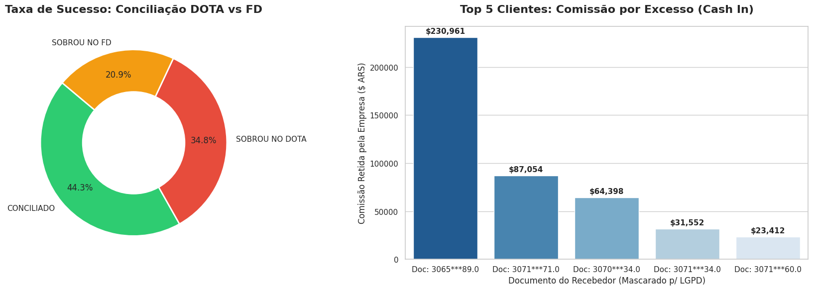

# 📊 Data & Business Analytics: Conciliação Financeira e Auditoria de Adquirência

## 🎯 Objetivo do Projeto
Este projeto de **Business e Data Analytics** foca em resolver um problema crítico de backoffice financeiro: a perda de receita por falhas de repasse. 

O objetivo foi desenvolver uma automação analítica para conciliar o fluxo de caixa de um sistema interno (DOTA) contra os relatórios de liquidação de adquirentes e bandeiras (Reporte FD). A solução engloba desde a limpeza de dados brutos até a aplicação de regras de negócio para roteamento de cartões, culminando em um diagnóstico de divergências financeiras e cálculo de comissionamento.

---

## 💡 Principais Insights de Negócio
Através do cruzamento das bases e modelagem dos dados, a análise revelou:
* **Gargalo de Liquidação:** Identificação de **32.694 transações** registradas no sistema interno que não foram reconhecidas pela adquirente, configurando um risco direto ao fluxo de caixa.
* **Oportunidade de Receita (Cash In):** Mapeamento e cálculo automatizado de impostos progressivos sobre excesso de transações, rankeando os Top 5 clientes que mais geram comissões adicionais para a operação.

---

## 🛠️ Data Prep & Modelagem de Regras de Negócio

Para garantir a qualidade da análise, uma robusta etapa de preparação de dados foi construída utilizando Python (Pandas/NumPy):

1. **Governança e PCI Compliance:** Criação de máscaras de segurança ocultando dados sensíveis de cartões, isolando apenas BINs e últimos dígitos.
2. **Sanitização e Padronização:** Limpeza de códigos de autorização nulos ('000000') e roteamento dinâmico de nomenclaturas de adquirentes (ex: agrupamento Mastercard/Diners como 'FD').
3. **Lógica de Fallback (Bandeiras):** Implementação de cascateamento lógico para descobrir a bandeira do cartão via fatiamento de BINs quando a informação original era ausente.
4. **Coalesce de Identificadores:** Preenchimento inteligente de IDs de estabelecimentos comerciais, varrendo múltiplas colunas do sistema em ordem estrita de prioridade financeira.
5. **Auditoria de Conciliação (Match):** Execução de um *Outer Join* rigoroso utilizando **5 chaves de validação simultâneas** `[ID Comércio, BIN, Últimos 4 Dígitos, Data Nominal, Montante]`.

---

## 📈 Dashboard Executivo

Visualização gerada via código (Matplotlib/Seaborn) para facilitar a tomada de decisão da diretoria financeira:

  

* **Taxa de Sucesso:** A visualização em rosca demonstra o percentual exato do *match* financeiro contra os volumes órfãos em cada ponta da operação.
* **Top 5 Comissões:** O ranking em barras evidencia os clientes de maior volumetria (com documentos mascarados via LGPD) que geraram as maiores taxas de excesso retidas.

---
*Disclaimer: Os arquivos originais de banco de dados (`.xlsx`) foram intencionalmente omitidos deste repositório público para garantir a confidencialidade e adequação à LGPD.*
